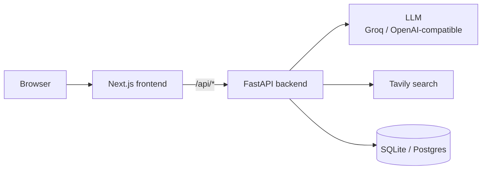

# Rinti AI

> A conversational AI workspace with per-user memory, a cited multi-step research mode and real account sessions, on FastAPI and Next.js.

## Overview

Rinti AI pairs an OpenAI-compatible chat backend (Groq by default) with a research engine that plans sub-queries, searches, extracts sources and synthesises a cited answer instead of forwarding a prompt. Sessions use real accounts: Argon2-hashed passwords, HttpOnly session cookies and a CSRF header check on every state-changing route. Usage is capped per user per day, because the model and search keys are shared server-side.

## Features

- **Streaming chat** with saved conversations, backed by an OpenAI-compatible endpoint
- **Memory**: per-user memory items you can list, add and delete
- **Research mode** (Quick and Standard budgets): intent detection, query planning, Tavily search, page extraction (trafilatura / BeautifulSoup), claim evaluation and synthesis, rendered with a sources panel and inline citations
- **Authentication**: register, login, logout and session restore
- **Model selection**: lists the models the backend reports as available
- **Per-user daily limits** on chat messages and research queries
- **Dark UI** with a gradient background, an orb, and Lenis smooth scrolling

## Tech Stack

| Layer | Technology |
| --- | --- |
| Backend | FastAPI, Uvicorn, Pydantic / pydantic-settings, `openai` client, Argon2 (`argon2-cffi`), trafilatura, BeautifulSoup |
| Storage | SQLite locally, Postgres in production (`psycopg2`) |
| Frontend | Next.js 15 (App Router), React 19, TypeScript, Tailwind CSS 3, Framer Motion, Lenis |
| Services | Groq or any OpenAI-compatible LLM, Tavily search |

## Project Structure

```
Rinti-Ai/
├── backend/
│   ├── main.py              # FastAPI app, CORS, router registration
│   ├── config.py            # Environment-driven settings
│   ├── api/                 # auth, chat, memory, research, settings, health, voice
│   ├── auth/                # Password hashing, session and CSRF dependencies
│   ├── core/                # Chat "brain" and personality
│   ├── memory/              # SQLite/Postgres persistence layer
│   ├── research/            # intent, planner, engine, evaluator, claims, synthesis,
│   │                        #   providers/ (Tavily), extractors/
│   ├── voice/               # Speech-to-text and text-to-speech helpers
│   ├── scripts/             # migrate_sqlite_to_postgres.py
│   └── requirements.txt
├── frontend/
│   ├── app/                 # (app)/ chat, memory, models, settings; (auth)/ login, register
│   ├── components/          # chat, research, memory, models, navigation, layout, orb
│   ├── hooks/  providers/  lib/  ui/  styles/  middleware.ts
├── vercel.json              # Frontend and backend services, /api routing
└── assets/                  # README placeholder graphics
```

## Getting Started

**Prerequisites:** Python 3, Node.js and npm, an OpenAI-compatible API key (Groq works) and, for research mode, a Tavily key.

### Backend

```bash
cd backend
python -m venv .venv
.venv\Scripts\activate           # macOS/Linux: source .venv/bin/activate
pip install -r requirements.txt
# create backend/.env (see Configuration)
uvicorn main:app --reload        # http://localhost:8000
```

### Frontend

```bash
cd frontend
npm install
npm run dev                      # http://localhost:3000
```

> The frontend calls same-origin `/api/*`. On Vercel, `vercel.json` routes that path to the backend service. This repository has no local Next.js proxy, so for local full-stack use you need `/api/*` on port 3000 routed to the backend on port 8000 (for example with the Vercel CLI).

## Configuration

Backend variables, read from `backend/.env`:

| Variable | Purpose | Default |
| --- | --- | --- |
| `OPENAI_API_KEY` | Groq or OpenAI-compatible API key | none |
| `OPENAI_BASE_URL` | LLM endpoint | `https://api.groq.com/openai/v1` |
| `TAVILY_API_KEY` | Required for research mode | none |
| `ENVIRONMENT` | `production` makes `DATABASE_URL` mandatory at startup | `development` |
| `DATABASE_URL` | Postgres connection string | unset, so SQLite is used |
| `DB_PATH` | SQLite file when `DATABASE_URL` is unset | `rinti_memory.db` |
| `ALLOWED_ORIGINS` | Comma-separated CORS allowlist | `http://localhost:3000,http://127.0.0.1:3000` |
| `MAX_CHAT_MESSAGES_PER_DAY` | Per-user chat cap | `40` |
| `MAX_RESEARCH_QUERIES_PER_DAY` | Per-user research cap | `8` |
| `HOST`, `PORT` | Server bind | `0.0.0.0`, `8000` |

Never commit `.env`.

## Architecture



The browser only talks to the Next.js origin. `middleware.ts` is a UX-only redirect based on the presence of a session cookie; the real check happens in the backend, where every protected route validates the session and state-changing routes require the `X-Rinti-Client` header as CSRF mitigation. Research runs as a pipeline (intent, plan, search, extract, evaluate, synthesise) with a budget per mode defined in `backend/research/config.py`.

### API

All routes are under `/api`.

| Area | Routes |
| --- | --- |
| Auth | `POST /auth/register`, `/auth/login`, `/auth/logout`; `GET /auth/me` |
| Chat | `POST /chat`, `POST /chat/stream`; `GET /conversations`, `GET`/`DELETE /conversations/{id}`; `GET /usage` |
| Memory | `GET`/`POST /memory`, `DELETE /memory/{id}` |
| Research | `GET /research/status`, `POST /research/intent`, `POST /research/stream` |
| Settings | `GET /settings`, `/voices`, `/models` |
| Health | `GET /health` |

The speech code in `backend/voice/` and `backend/api/voice.py` exists, but the voice router is not registered in `main.py`, so the voice endpoints are currently not served. Text-to-speech is a stub that returns empty audio.

## Deployment

`vercel.json` defines a `frontend` service (Next.js, `frontend/`) and a `backend` service (`main:app`, 60 s max duration) and routes `/api/*` to the backend. In production set `ENVIRONMENT=production` and `DATABASE_URL`, since Vercel Functions have no durable filesystem for SQLite. `backend/scripts/migrate_sqlite_to_postgres.py` migrates existing data.

## Screenshots

`assets/` holds placeholder graphics only, so no screenshots are shown.

## Future Improvements

- Mount the voice router and implement real text-to-speech
- Add a local development proxy for `/api/*`
- Automated tests (none are included)

## License

MIT, see [LICENSE](LICENSE).
