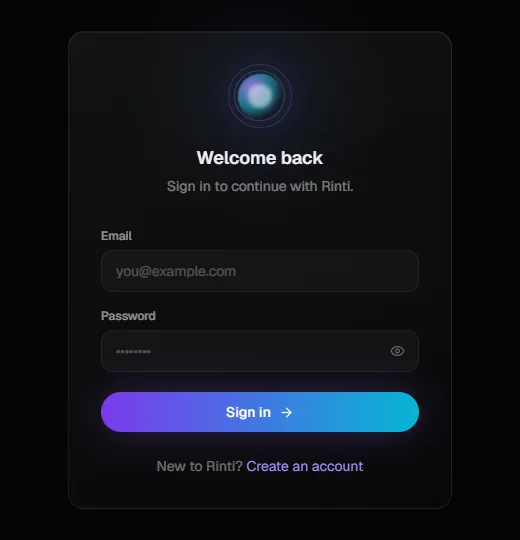
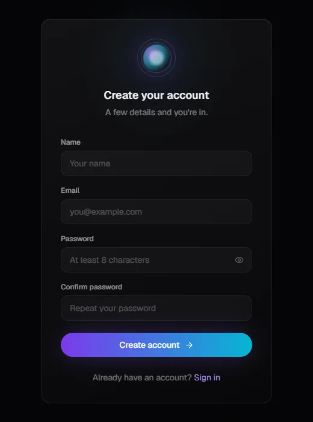
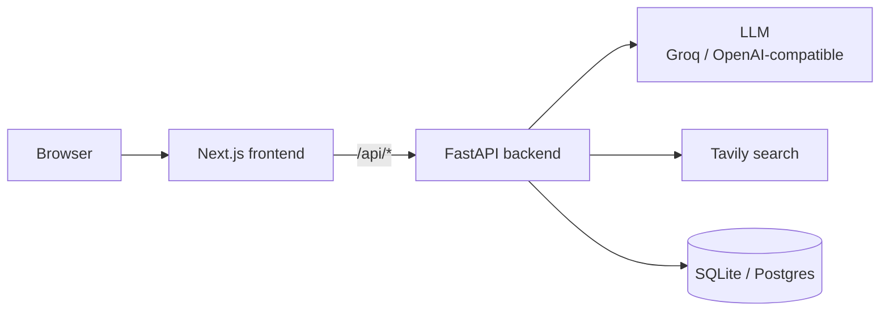

<div align="center">

# Rinti AI

**A chat workspace with per-user memory, a cited research mode and real account sessions.**

<br />

<table>
  <tr>
    <td align="center"><br /><sub>Sign in</sub></td>
    <td align="center"><br /><sub>Create an account</sub></td>
  </tr>
</table>
<sub>The only screens that render without the backend. Everything behind sign-in needs the API running.</sub>

<br />
<br />

     

<br />

**[Run it](#run-it)** &nbsp;·&nbsp; **[Features](#features)** &nbsp;·&nbsp; **[Architecture](#architecture)** &nbsp;·&nbsp; **[Installation](#installation)** &nbsp;·&nbsp; **[API](#api)**

</div>

---

Rinti AI pairs an OpenAI-compatible chat backend (Groq by default) with a research engine that plans sub-queries, searches, extracts sources and synthesises a cited answer, instead of just forwarding a prompt. Sessions use real accounts: Argon2-hashed passwords, HttpOnly session cookies and a CSRF header check on every state-changing route. Because the model and search keys are shared server-side, usage is capped per user per day.

The backend is FastAPI with SQLite for local development and Postgres in production; the frontend is Next.js with a dark, orb-centred interface.

## Run it

You need an OpenAI-compatible API key (Groq works), and a Tavily key for research mode.

```bash
git clone https://github.com/Samudra-GITHub/Rinti-Ai.git
cd Rinti-Ai/backend && python -m venv .venv && .venv\Scripts\activate && pip install -r requirements.txt
uvicorn main:app --reload        # needs backend/.env, see Installation
```

```bash
cd Rinti-Ai/frontend && npm install && npm run dev
```

The frontend calls same-origin `/api/*`, which only `vercel.json` routes to the backend. There is no local proxy in the repo, so a local full-stack run needs `/api/*` on port 3000 routed to port 8000 (for example with the Vercel CLI).

## Features

<table>
  <tr>
    <td width="50%" valign="top">
      <h3>Streaming chat</h3>
      <p>Streaming replies from an OpenAI-compatible endpoint, with saved conversations you can list, reopen and delete, and a model selector that lists what the backend reports as available.</p>
    </td>
    <td width="50%" valign="top">
      <h3>Memory</h3>
      <p>Per-user memory items you can list, add and delete, kept in SQLite locally or Postgres in production.</p>
    </td>
  </tr>
  <tr>
    <td width="50%" valign="top">
      <h3>Research mode</h3>
      <p>Quick and Standard budgets. Intent detection, query planning, Tavily search, page extraction (trafilatura and BeautifulSoup), claim evaluation and synthesis, rendered with a sources panel and inline citations.</p>
    </td>
    <td width="50%" valign="top">
      
      <h3>Real accounts</h3>
      <p>Register, login, logout and session restore. Passwords are hashed with Argon2, sessions use HttpOnly cookies, and state-changing routes require an <code>X-Rinti-Client</code> header as CSRF mitigation.</p>
    </td>
  </tr>
</table>

**Also:** per-user daily caps on chat messages and research queries; Lenis smooth scrolling and a gradient background with an orb.

## Tech stack

| Layer | Technology |
| :-- | :-- |
| Backend | FastAPI, Uvicorn, Pydantic and pydantic-settings, the `openai` client, Argon2, trafilatura, BeautifulSoup |
| Storage | SQLite locally, Postgres in production (`psycopg2`) |
| Frontend | Next.js 15 (App Router), React 19, TypeScript 5, Tailwind CSS 3, Framer Motion, Lenis |
| Services | Groq or any OpenAI-compatible LLM, Tavily search |

## Architecture



The browser only talks to the Next.js origin. `middleware.ts` is a UX-only redirect based on whether a session cookie is present; the real check is in the backend, where every protected route validates the session. Research runs as a pipeline (intent, plan, search, extract, evaluate, synthesise) with a budget per mode in `backend/research/config.py`.

```text
Rinti-Ai/
├── backend/
│   ├── main.py          FastAPI app, CORS, router registration
│   ├── config.py        Environment-driven settings
│   ├── api/             auth, chat, memory, research, settings, health, voice
│   ├── auth/            Password hashing, session and CSRF dependencies
│   ├── core/            Chat "brain" and personality
│   ├── memory/          SQLite and Postgres persistence
│   ├── research/        intent, planner, engine, evaluator, claims, synthesis, providers/, extractors/
│   ├── voice/           Speech helpers (router not mounted, see below)
│   └── scripts/         migrate_sqlite_to_postgres.py
├── frontend/
│   ├── app/             (app)/ chat, memory, models, settings; (auth)/ login, register
│   └── components/  hooks/  providers/  lib/  ui/  styles/  middleware.ts
├── vercel.json          Frontend and backend services, /api routing
└── docs/screenshots/
```

### API

All routes are under `/api`.

| Area | Routes |
| :-- | :-- |
| Auth | `POST /auth/register`, `/auth/login`, `/auth/logout`; `GET /auth/me` |
| Chat | `POST /chat`, `POST /chat/stream`; `GET /conversations`, `GET` and `DELETE /conversations/{id}`; `GET /usage` |
| Memory | `GET` and `POST /memory`, `DELETE /memory/{id}` |
| Research | `GET /research/status`, `POST /research/intent`, `POST /research/stream` |
| Settings | `GET /settings`, `/voices`, `/models` |
| Health | `GET /health` |

The speech code in `backend/voice/` and `backend/api/voice.py` exists, but the voice router is not registered in `main.py`, so those endpoints are not served. Text-to-speech is a stub that returns empty audio.

## Installation

Requires Python 3, Node.js and npm.

```bash
cd backend
python -m venv .venv
.venv\Scripts\activate           # macOS/Linux: source .venv/bin/activate
pip install -r requirements.txt
uvicorn main:app --reload        # http://localhost:8000
```

```bash
cd frontend
npm install
npm run dev                      # http://localhost:3000
```

### Environment

Variables are read from `backend/.env`. Never commit it.

| Variable | Purpose | Default |
| :-- | :-- | :-- |
| `OPENAI_API_KEY` | Groq or OpenAI-compatible API key | none |
| `OPENAI_BASE_URL` | LLM endpoint | `https://api.groq.com/openai/v1` |
| `TAVILY_API_KEY` | Required for research mode | none |
| `ENVIRONMENT` | `production` makes `DATABASE_URL` mandatory at startup | `development` |
| `DATABASE_URL` | Postgres connection string | unset, so SQLite is used |
| `DB_PATH` | SQLite file when `DATABASE_URL` is unset | `rinti_memory.db` |
| `ALLOWED_ORIGINS` | Comma-separated CORS allowlist | `http://localhost:3000,http://127.0.0.1:3000` |
| `MAX_CHAT_MESSAGES_PER_DAY` | Per-user chat cap | `40` |
| `MAX_RESEARCH_QUERIES_PER_DAY` | Per-user research cap | `8` |
| `HOST`, `PORT` | Server bind | `0.0.0.0`, `8000` |

### Deploy

`vercel.json` defines a `frontend` service (Next.js, `frontend/`) and a `backend` service (`main:app`, 60 s max duration) and routes `/api/*` to the backend. In production set `ENVIRONMENT=production` and `DATABASE_URL`, because Vercel Functions have no durable filesystem for SQLite. `backend/scripts/migrate_sqlite_to_postgres.py` migrates existing data.

## Limitations

- Voice endpoints are not mounted, and text-to-speech returns empty audio.
- No local `/api` proxy, and no automated tests.
- Screenshots cover only the sign-in and register screens, because everything else needs the backend.

## License

[MIT](LICENSE).
